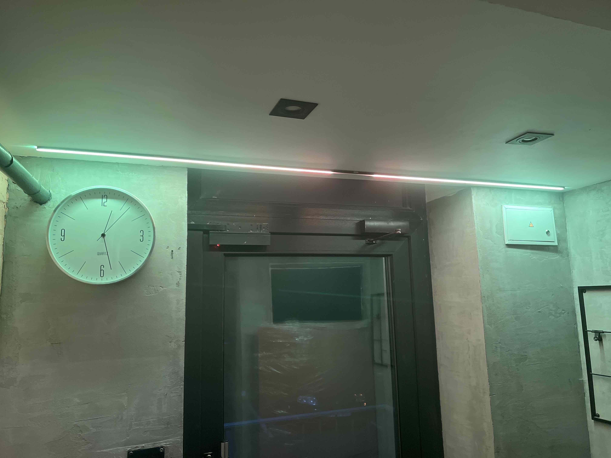

# LED Alerts in Ukraine Information

LED Alerts є проектом, який використовує світлодіодну стрічку для оповіщення про різні види небезпек, такі як повітряна небезпека та радіація.

Проект складається з трьох скриптів:

## air_raids_alert.py

Цей скрипт відстежує повідомлення про воздушну небезпеку, підключаючись до сервера WebSocket та отримуючи дані про ці повідомлення. Сервером джерелом даних є "<https://map.ukrainealarm.com>". Скрипт отримує повідомлення з сервера WebSocket та використовує клас `LedAlerts` для відповідності областей та зон і визначення рівня небезпеки на підставі цих повідомлень. Рівень небезпеки надсилається на локальний сервер, який працює за адресою `http://127.0.0.1:8343`, для керування світлодіодною стрічкою.

## radiation_alert.py

Цей скрипт аналізує рівні радіації, отримуючи дані з різних джерел. Одне з джерел даних - це веб-сайт "<https://www.saveecobot.com/storage/maps_data.js>", який надає дані про рівні гамма-випромінювання з різних пристроїв. Скрипт перевіряє значення гамма-випромінювання відповідних пристроїв та визначає наявність високого рівня радіації. Якщо виявлено високий рівень радіації, надсилається сигнал на локальний сервер, який працює за адресою `http://127.0.0.1:8343`, для керування світлодіодною стрічкою.

## server.py

Цей скрипт налаштовує локальний сервер з використанням бібліотеки aiohttp. Сервер надає API для керування світлодіодною стрічкою на основі повідомлень про воздушну небезпеку та рівнів радіації. Він прослуховує адресу `http://127.0.0.1:8343` та надає такі маршрути:

- `/api/alerts`: GET-запит для отримання інформації про світлодіодну стрічку, включаючи кількість пікселів та відображення кольорів для різних пріоритетів повідомлень.
- `/api/alerts/priority`: POST-запит для оновлення пріоритету повідомлень про воздушну небезпеку на світлодіодній стрічці. Нове значення пріоритету надсилається у тілі запиту.
- `/api/alerts/rad`: POST-запит для оновлення статусу радіації на світлодіодній стрічці. Новий статус радіації надсилається у тілі запиту.

## Встановлення та налаштування

1. Завантажте репозиторій на свій пристрій.
2. Встановіть необхідні залежності, виконавши команду `pip install aiohttp neopixel board`.
3. Налаштуйте та підключіть світлодіодну стрічку до вашого пристрою. Переконайтеся, що у вас є необхідні дозволи та права доступу для взаємодії з апаратними компонентами.
4. Відредагуйте файли `air_raids_alert.py` та `radiation_alert.py`, якщо необхідно, щоб відповідати вашому апаратному забезпеченню та налаштуванням.
5. Запустіть скрипт `server.py`, щоб запустити локальний сервер для керування світлодіодною стрічкою. Сервер буде слухати за адресою `http://127.0.0.1:8343`.
6. Налаштуйте автозавантаження скриптів за допомогою SystemD, використовуючи скрипт установки, який доступний у репозиторії. Виконайте `install.sh` з правами суперкористувача (`sudo`) для встановлення та налаштування служб.

Після успішного виконання скрипту установки, скрипти `air_raids_alert.py`, `radiation_alert.py` та `server.py` автоматично додані до автозавантаження за допомогою SystemD і будуть запускатись під час завантаження системи. Ви зможете керувати службами за допомогою команди `systemctl` (наприклад, `sudo systemctl start air_raids_alert.service` для запуску служби `air_raids_alert`).

## Співробітництво

Вносити внески до цього репозиторію вітається. Якщо у вас виникли проблеми або у вас є пропозиції щодо вдосконалення, будь ласка, створіть питання (issue) або надішліть запит на злиття (pull request).

## Ліцензія

Цей репозиторій розповсюджується під ліцензією MIT. Детальніше дивіться у файлі `LICENSE`.
